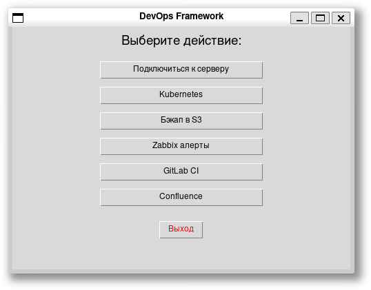
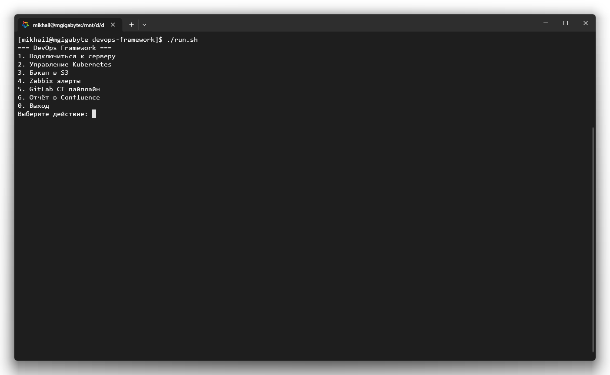

# 🧰 DevOps Framework

> Bash + Python фреймворк для автоматизации задач DevOps  
> Поддерживает работу с Kubernetes, Zabbix, GitLab CI/CD, S3, Confluence и другими инструментами  
> Графический интерфейс (Tkinter) и CLI

---





---

## 📦 Что умеет?

- ✅ Подключение к серверам по SSH
- ✅ Управление Kubernetes (kubectl)
- ✅ Автоматизация через Ansible
- ✅ Бэкапы в AWS S3
- ✅ Интеграция с Zabbix API
- ✅ Запуск пайплайнов в GitLab CI/CD
- ✅ Генерация отчетов в Confluence
- ✅ Логирование всех действий
- ✅ Простой GUI на Python/Tkinter

---

## 🚀 Как установить

### 1. Клонировать репозиторий:

```bash
git clone https://github.com/ваше-имя/devops-framework.git
cd devops-framework
```

### 2. Установить зависимости:

```bash
make install-deps
```

> Устанавливаются:
> - `ansible`, `kubectl`, `awscli`, `jq`, `yq`, `sshpass`, `curl`
> - Python 3 + Tkinter для GUI

---

## 🔐 Настройка

### 1. Серверы (`config/servers.yaml`)

```yaml
servers:
  prod:
    ip: "192.168.1.10"
    user: "admin"
    password: "secure_password"
    ssh_key: "~/.ssh/id_rsa"

  staging:
    ip: "192.168.1.11"
    user: "deploy"
    password: "another_secure_pass"
```

### 2. Секреты (`config/secrets.env`)

```bash
export ZABBIX_URL="http://zabbix.example.com/api_jsonrpc.php"
export ZABBIX_USER="admin"
export ZABBIX_PASS="password"

export GITLAB_TOKEN="your_token_here"
export CONFLUENCE_USER="user"
export CONFLUENCE_TOKEN="api_token"
```

> Не забудь загрузить переменные перед запуском:
```bash
source config/secrets.env
```

---

## 🖥️ Как использовать

### CLI режим:

```bash
./run.sh
```

### GUI режим:

```bash
python3 gui/gui.py
```

---

## 🛠️ Доступные функции

| Функция                  | Описание |
|--------------------------|----------|
| `connect_to_server`      | Подключение к серверу по SSH |
| `k8s list_pods`          | Показать все поды в Kubernetes |
| `backup_to_s3`           | Создать бэкап и отправить в S3 |
| `zabbix_get_alerts`      | Получить алерты из Zabbix |
| `trigger_pipeline`       | Запустить GitLab CI пайплайн |
| `create_confluence_page` | Создать страницу в Confluence |

---

## 📈 Возможности развития

| Направление              | Возможность |
|--------------------------|-------------|
| Cloud                    | AWS / GCP / Yandex.Cloud |
| IaC                      | Terraform, Pulumi |
| CI/CD                    | Jenkins, GitHub Actions |
| Monitoring               | Prometheus, Grafana, Loki |
| Network                  | iptables, NAT, VLAN |
| AI / ML                  | Предсказание нагрузки, анализ логов |
| Plugins                  | Расширение через `.devops_plugin` |
| GUI                      | PyQt5 / Flask Web UI |
| Documentation            | Авто-генерация диаграмм и отчетов |

---

## 📁 Структура проекта

```
devops-framework/
├── config/
│   ├── servers.yaml        # Конфиг серверов
│   └── secrets.env         # Переменные окружения
├── scripts/
│   ├── ansible.sh          # Ansible
│   ├── k8s.sh              # Kubernetes
│   ├── zabbix.sh           # Zabbix API
│   ├── gitlab.sh           # GitLab CI/CD
│   ├── s3.sh               # Резервные копии
│   ├── confluence.sh       # Отчёты в Confluence
│   └── connect.sh          # Подключение к серверам
├── logs/
│   └── activity.log        # Логирование действий
├── gui/
│   └── gui.py              # Tkinter GUI
├── docs/
│   └── architecture.md     # Архитектура
├── README.md               # Это документ
├── LICENSE                 # Лицензия MIT
└── Makefile                # Команды сборки
```

---

## 📄 Команды Makefile

```bash
make install-deps     # Установить зависимости
make run-cli          # Запустить CLI версию
make run-gui          # Запустить GUI версию
make test             # Проверить синтаксис скриптов
make clean            # Очистить логи
```

---

## ✅ Лицензия

MIT License — свободно используй и модифицируй.

---

## 💬 Вопросы? Идеи?

Создай issue или pull request!  
Хочешь улучшить фреймворк? Добавь свой модуль в папку `modules/`.
